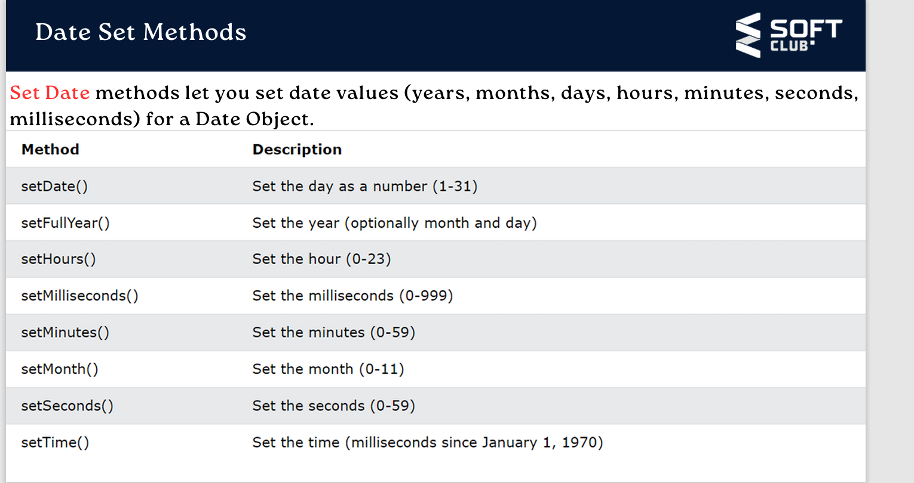

# new DATE- chist? 

>Yak konstruktore hast ki obyekti Date ` DEYT` mesoza va `4` namud rohi soxtan dora.

>`1-` new Date() - Vaqtu sanaro mebrora (dar verebl baxshiham kormekna)

>`2-` new Date (yak parametr qabul mekna az soli `1970` hisob mekna)

>`3-` new Date (String qabul mekna `1- sol `,`2-moh`,`3-ruz`
 
 >amerikanski `1-moh`,`2-ruz`,`3-sol`)

 >`4-` new Date(`to 7 parametr qabul mekna`)

 ### M E T O D H O I    `n e w D A T E()`

 `1`getFullyear(solro megirad az `new Date` dodagi polzvatel)

 `2`getMonth(mohro megirad az indexi `0 to 11`)

 `3`getDate(ruza megira az `1 to 31`)

 `4`getDay(ruzi haftara mebrora az `0 to 6`)

 `5`getHours(soatro megira az `0 to 23`)

`6` getMinutes(munuta megira az `0 to 59`)

`7` getSeconds(secunda megira az `0 to 59`)

`8` getMilliseconds(mili secunda megira az `0 to 999`)

`9` getTime(az 1 yanvari 1970 to hozira chad milli seconds  guzashta boshad nishon metiya )

## Set Date ?
 `DILXOH VAQT SOAT ,MEXOSTARO MEMONAD ` 
 

 